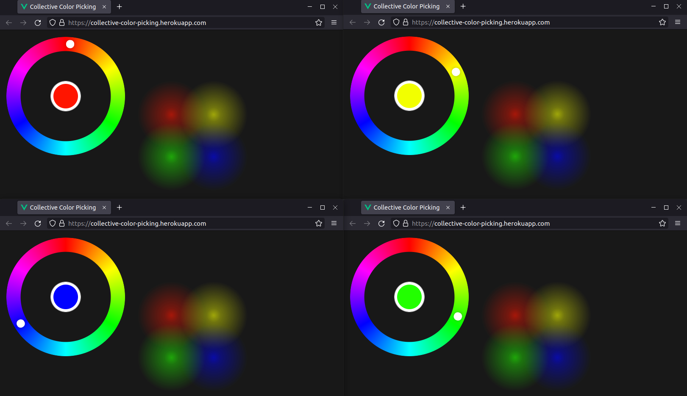

# collective color picking

[](https://github.com/fladdimir/collective-color-picking/actions/workflows/build.yml)

[](https://sonarcloud.io/summary/new_code?id=collective-color-picking)

[](https://sonarcloud.io/summary/new_code?id=collective-color-picking)

sample websocket application with logging



## docker image

- nginx (vue frontend file-server, reverse-proxy)
- quarkus (back-end)
- grafana-agent (scraping/forwarding of logs, metrics, traces)
- rsyslog (nginx log translation)

## deploy to heroku

automatically on push to `heroku` branch, or manually:

```sh
# deploy new version:

heroku container:push web --app collective-color-picking
heroku container:release web --app collective-color-picking

# initial postgres setup:

heroku addons:create heroku-postgresql:hobby-dev --app collective-color-picking

# scaling:

heroku ps:scale web=0 --app collective-color-picking

# configure app environment variables:

heroku config:set METRICS_REMOTE_WRITE_URL=${METRICS_REMOTE_WRITE_URL} --app collective-color-picking
heroku config:set METRICS_REMOTE_WRITE_BASIC_USERNAME=${METRICS_REMOTE_WRITE_BASIC_USERNAME} --app collective-color-picking
heroku config:set METRICS_REMOTE_WRITE_BASIC_PASSWORD=${METRICS_REMOTE_WRITE_BASIC_PASSWORD} --app collective-color-picking

heroku config:set TRACES_REMOTE_WRITE_ENDPOINT=${TRACES_REMOTE_WRITE_ENDPOINT} --app collective-color-picking
heroku config:set TRACES_REMOTE_WRITE_INSECURE=${TRACES_REMOTE_WRITE_INSECURE} --app collective-color-picking
heroku config:set TRACES_REMOTE_WRITE_BASIC_USERNAME=${TRACES_REMOTE_WRITE_BASIC_USERNAME} --app collective-color-picking
heroku config:set TRACES_REMOTE_WRITE_BASIC_PASSWORD=${TRACES_REMOTE_WRITE_BASIC_PASSWORD} --app collective-color-picking

heroku config:set LOGS_REMOTE_WRITE_URL=${LOGS_REMOTE_WRITE_URL} --app collective-color-picking
heroku config:set LOGS_REMOTE_WRITE_BASIC_USERNAME=${LOGS_REMOTE_WRITE_BASIC_USERNAME} --app collective-color-picking
heroku config:set LOGS_REMOTE_WRITE_BASIC_PASSWORD=${LOGS_REMOTE_WRITE_BASIC_PASSWORD} --app collective-color-picking

```

## kill all gradle deamons

```sh
pkill -f '.*GradleDaemon.*'
```
